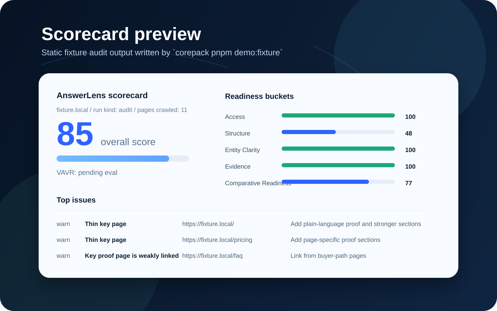
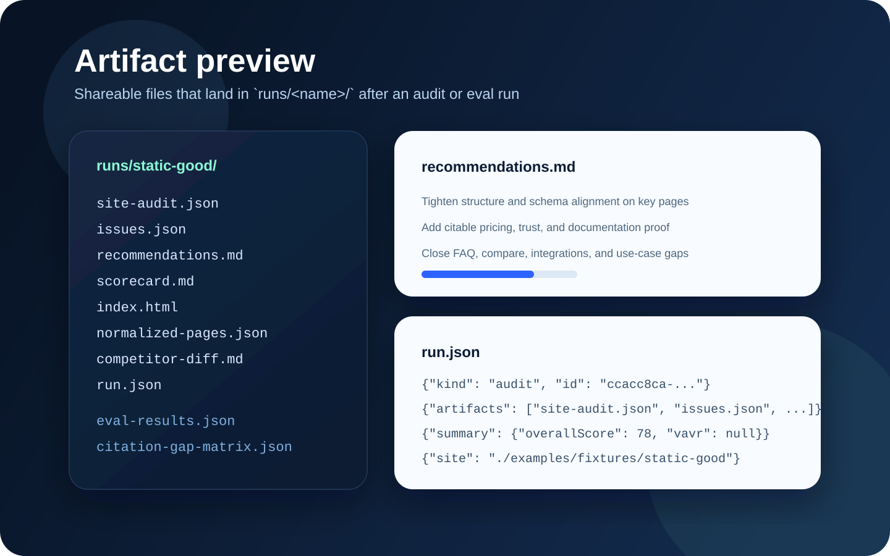
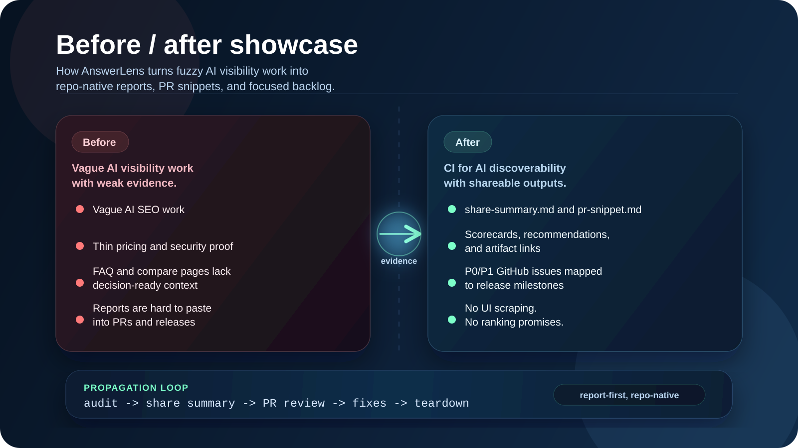

# AnswerLens

[English](README.md) | [简体中文](README.zh-CN.md)

[](https://github.com/YSCJRH/ai-visibility-auditor/actions/workflows/ci.yml)
[](https://github.com/YSCJRH/ai-visibility-auditor/actions/workflows/demo-audit.yml)
[](https://github.com/YSCJRH/ai-visibility-auditor/releases)
[](LICENSE)


> CI for AI discoverability.

AnswerLens is a CLI-first, GitHub-native AI visibility auditor for product websites. It audits public product pages and writes report files your team can review in GitHub.

It shows whether AI systems can understand what you sell, find supporting proof, read pricing and comparison pages, and cite the right source material.

Open-source. Command-line first. Report-driven. No consumer AI UI scraping. No ranking promises. No hosted dashboard required. No dashboard-first rewrite.

## Start here

Start with the report, not a setup guide:

1. [Open the live demo report](https://yscjrh.github.io/ai-visibility-auditor/examples/static-good/index.html)
   The fastest way to see the summary, scorecard, and fix list together.
   If you are browsing a fork or copy without Pages enabled, use the [repo walkthrough fallback](docs/demo-report.md).
2. [Run the 60-second fixture demo](#run-the-60-second-fixture-demo)
   Reproduce the same reports locally so the command feels concrete.
3. [Run a 5-minute real-site audit](docs/quickstart.md)
   Try one public product site before you wire CI.
4. [Add the GitHub Action](docs/github-action.md)
   Move the same report set into pull requests, artifact uploads, and `GITHUB_STEP_SUMMARY`.

Across every step, keep the report order fixed: `share-summary.md`, then `scorecard.md`, then `recommendations.md`.

If you already know you want CI, the Action docs remain public, but the easiest path is still demo -> sample site -> real site -> Action.

For safe sharing and first-run feedback, keep [trust and safety](docs/trust-and-safety.md) and the [first-run story template](docs/first-run-story.md) beside the report.

## What you get

- `audit` for AI-readiness checks against a live site or local fixture
- `eval` for prompt-pack benchmarking with OpenAI and Perplexity adapters
- `manual-import` for scoring normalized answer samples from external or human-collected runs
- `search-console-import` for validating key-page evidence against imported page-level Search Console exports
- `bing-indexnow-helper` for Bing validation imports plus IndexNow helper artifacts
- Repo-native outputs such as `share-summary.md`, `pr-snippet.md`, `run.json`, and `index.html`

## Why AnswerLens

- CI for AI discoverability, built for Git workflows instead of hosted-dashboard lock-in
- Explainable audit rules that focus on why AI systems miss or misread a site
- A report-first, repo-native workflow that turns runs into artifacts teams can review and ship against
- A validation-oriented path that avoids scrape-and-rank claims and keeps evidence visible

## What this is not

- Not a "rank #1 in ChatGPT" hack
- Not a consumer AI UI scraper
- Not a generic AI content generator
- Not a dashboard-first rewrite of the CLI workflow
- Not a replacement for Search Console or analytics
- Not a guarantee of placement on any answer surface

## Run the 60-second fixture demo

```bash
corepack enable
corepack pnpm install
corepack pnpm demo:fixture
```

That command audits the local fixture in [examples/fixtures/static-good](examples/fixtures/static-good) and writes outputs to [runs/static-good](runs/static-good).

Inside the demo artifact set, `https://fixture.local` is the stable fixture hostname. It keeps the example crawl reproducible and is not the AnswerLens product site URL.

Open these fixture artifacts first, in order:

1. `share-summary.md`
2. `scorecard.md`
3. `recommendations.md`

Then use:

- `pr-snippet.md` for a copy-ready GitHub block
- `index.html` for browser review

Next step: use the same `.github/answerlens/` folder shape in [docs/quickstart.md](docs/quickstart.md) and run one real-site audit before CI.

The first shareable result looks like this:

```md
## AnswerLens audit

**CI for AI discoverability.** Readiness: **90/100**. VAVR: **pending eval**.

AI may miss this product because:
- Thin key page: add plain-language explanations, evidence blocks, and stronger sections.
```

## Open the live demo report

- Canonical live demo URL: [Pages sample report](https://yscjrh.github.io/ai-visibility-auditor/examples/static-good/index.html)
- Repo walkthrough fallback: [docs/demo-report.md](docs/demo-report.md)
- Open these artifacts first, in order:
  - `share-summary.md`
  - `scorecard.md`
  - `recommendations.md`
- Then use:
  - `pr-snippet.md`
  - `index.html`
- Next step: run the local fixture demo, then use the real-site quickstart before you move into GitHub Actions.

## Run a 5-minute real-site audit

Use [docs/quickstart.md](docs/quickstart.md) after the fixture demo and before CI adoption.

- Copy the starter bundle shape from [examples/consumer-repo](examples/consumer-repo) into `./.github/answerlens/`.
- Run one local `audit` against your own public site with the same config layout that later moves into GitHub Actions.
- Open `share-summary.md`, then `scorecard.md`, then `recommendations.md` before you look at `pr-snippet.md` or `index.html`.
- If that first real-site run feels useful, carry the same folder shape into [docs/github-action.md](docs/github-action.md).

## Add the GitHub Action

Start with [docs/github-action.md](docs/github-action.md) and copy the external starter bundle from [examples/consumer-repo](examples/consumer-repo).

If you want a public, citable overview of that path before opening raw repo files, use the [starter bundle overview](https://yscjrh.github.io/ai-visibility-auditor/starter/).

If you have not run one real local audit yet, use [docs/quickstart.md](docs/quickstart.md) first. The Action should feel like the CI version of the same artifact-backed workflow, not a separate adoption path.

Treat the starter bundle as the shareable adoption asset for forks, releases, and external setup guides.
For the first CI pull request, use the starter [Adopter kit checklist](docs/starter-bundle.md#adopter-kit-checklist) and [PR review packet](docs/starter-bundle.md#pr-review-packet) so teammates know which artifact to open and which raw payloads stay private.


The public Action contract is:

- `uses: YSCJRH/ai-visibility-auditor@vX`
- `command: audit | eval | manual-import | search-console-import | bing-indexnow-helper`
- outputs: `out-dir`, `share-summary-path`, `scorecard-path`, `recommendations-path`, `pr-snippet-path`, `run-json-path`

## Install or download

- This README is the canonical home; GitHub Pages is the proof surface and releases are the second front door
- GitHub Action is the fastest CI-first entry point
- The cleanest one-off local run lives in [docs/quickstart.md](docs/quickstart.md)
- Release assets are the clearest tarball download surface: [latest release](https://github.com/YSCJRH/ai-visibility-auditor/releases/latest)
- npm publishing is wired through semver releases and requires either trusted publishing or `NPM_TOKEN`; see [docs/manual-steps.md](docs/manual-steps.md)
- If you copy this distribution pattern into another repository, GitHub Pages, repository homepage, social preview, topics, and Discussions routing still require explicit GitHub settings work

## Current status

| Area | Status |
| --- | --- |
| Audit CLI | Live |
| OpenAI eval | Live |
| Perplexity eval | Live |
| Manual answer import | Live |
| Search Console validation import | Live |
| Bing / IndexNow helpers | Live |

## Distribution

- Canonical distribution plan: [docs/distribution-plan.md](docs/distribution-plan.md)
- GitHub-native growth practice: [docs/github-growth-plan.md](docs/github-growth-plan.md)
- Self-dogfooding for discoverability: [docs/self-dogfooding.md](docs/self-dogfooding.md)
- Self-dogfood log: [docs/self-dogfood-log.md](docs/self-dogfood-log.md)
- Trust and safety: [docs/trust-and-safety.md](docs/trust-and-safety.md)
- First-run story template: [docs/first-run-story.md](docs/first-run-story.md)
- Model runtime defaults and override rules: [docs/model-runtime.md](docs/model-runtime.md)
- Manual setup checklist for Pages, npm, and repo settings: [docs/manual-steps.md](docs/manual-steps.md)
- 5-minute real-site quickstart: [docs/quickstart.md](docs/quickstart.md)
- GitHub Action usage and output contract: [docs/github-action.md](docs/github-action.md)
- Current activation and adoption brief: [docs/activation-plan.md](docs/activation-plan.md)

## Sample outputs

The fixture demo writes machine-readable audit artifacts, a static scorecard, and follow-up recommendations that can be shared in pull requests, issues, and release notes.





See [docs/demo-report.md](docs/demo-report.md) for the fixture report walkthrough.

## Before / after showcase

AnswerLens is designed to turn vague "AI SEO" work into concrete structure, evidence, and comparison fixes that a product team can actually ship.



## Why this exists

- AI answers are now a discovery layer.
- Traditional SEO is still necessary, but it is no longer the whole story.
- Teams need explainable, reproducible workflows instead of consumer UI scraping.

## Feedback and community

- First-run question or unclear result: [GitHub Discussions](https://github.com/YSCJRH/ai-visibility-auditor/discussions) in `Q&A`
- Share a screenshot, artifact, or first-run story: [Show and tell Discussion form](https://github.com/YSCJRH/ai-visibility-auditor/discussions/new?category=show-and-tell)
- Reproducible bug, docs gap, or concrete rule request: [GitHub Issues](https://github.com/YSCJRH/ai-visibility-auditor/issues)

If you try AnswerLens on a real site, use the [first-run story template](docs/first-run-story.md) and the [Show and tell Discussion form](https://github.com/YSCJRH/ai-visibility-auditor/discussions/new?category=show-and-tell) to tell us which artifact helped first.

## Repository layout

```text
apps/cli           User-facing command entrypoint
apps/admin         Internal control console for runs, presets, and artifact review
packages/core      Crawl, extract, audit, scoring, recommendations, config loading
packages/contracts Browser-safe contracts for the admin console
packages/admin-runtime File-backed runtime helpers for the admin BFF
packages/runtime-config Shared runtime.yaml loader and eval default resolution
packages/providers Live provider adapters and normalization contracts
packages/report    Markdown, JSON, and HTML report rendering
examples/          Demo configs and local fixtures
docs/              Architecture, scoring, limitations, activation notes, and roadmap
```

Copy the external starter bundle from [examples/consumer-repo](examples/consumer-repo) into `./.github/answerlens/` in the repo you want to audit, then use commands like these:

## Live audit

```bash
corepack pnpm audit -- https://example.com \
  --brand ./.github/answerlens/brand.yaml \
  --competitors ./.github/answerlens/competitors.yaml \
  --prompts ./.github/answerlens/prompts.yaml \
  --out ./runs/example
```

## Live eval

```bash
OPENAI_API_KEY=... corepack pnpm eval -- https://example.com \
  --brand ./.github/answerlens/brand.yaml \
  --competitors ./.github/answerlens/competitors.yaml \
  --prompts ./.github/answerlens/prompts.yaml \
  --out ./runs/example-eval
```

That command auto-loads `./.github/answerlens/runtime.yaml` from the same directory as `brand.yaml`.

Use flags such as `--profile`, `--provider`, `--model`, `--samples`, `--locale`, `--timeout-ms`, and `--base-url` only when you want a temporary override.

For the first live benchmark pass, start with `--profile fast-first-eval`. Use `--profile high-confidence-review` only when you are re-checking a smaller, messaging-sensitive prompt set.
Use `--profile perplexity-cross-check` only after you already have one readable OpenAI baseline and want a search-shaped second opinion.

Perplexity runs use the same command shape with `PERPLEXITY_API_KEY`. The full precedence rules and scenario matrix live in [docs/model-runtime.md](docs/model-runtime.md).

## Manual import

```bash
corepack pnpm manual-import -- https://example.com \
  --brand ./.github/answerlens/brand.yaml \
  --competitors ./.github/answerlens/competitors.yaml \
  --prompts ./.github/answerlens/prompts.yaml \
  --input ./responses.json \
  --out ./runs/example-import
```

`manual-import` accepts normalized `ProviderResponse[]` JSON or an object with a `responses` array.

If you have reviewed placement data from a manual validation pass, include `rankPosition` as a positive integer:

```json
[
  {
    "provider": "manual",
    "model": "manual-import",
    "promptId": "best-developer-analytics",
    "answerText": "Example Product is a recommended developer analytics platform with public docs and transparent pricing.",
    "citations": ["https://example.com/pricing"],
    "searchResults": [],
    "requestedAt": "2026-04-14T00:00:00.000Z",
    "locale": "en-US",
    "sampleIndex": 0,
    "runCount": 1,
    "holdout": false,
    "rankPosition": 1
  }
]
```

`manual-import` keeps `rankPosition` optional. When present, AnswerLens adds `competitivePositionScore` and `rankCoverageRate` to the eval summary and share summary outputs.

## Search Console validation import

```bash
corepack pnpm search-console-import -- https://example.com \
  --brand ./.github/answerlens/brand.yaml \
  --competitors ./.github/answerlens/competitors.yaml \
  --prompts ./.github/answerlens/prompts.yaml \
  --input ./gsc-pages.csv \
  --out ./runs/example-search-console
```

`search-console-import` accepts page-level Search Console CSV exports with these required columns:

- `page`
- `clicks`
- `impressions`
- `ctr`
- `position`

It uses Search Console as an external evidence layer for existing audit findings. It does not replace audit, eval, analytics, or Search Console itself.

## Bing / IndexNow helper

```bash
corepack pnpm bing-indexnow-helper -- https://example.com \
  --brand ./.github/answerlens/brand.yaml \
  --competitors ./.github/answerlens/competitors.yaml \
  --prompts ./.github/answerlens/prompts.yaml \
  --bing-input ./bing-pages.csv \
  --out ./runs/example-bing
```

`bing-indexnow-helper` imports page-level Bing Webmaster CSV exports using the same required columns as Search Console validation:

- `page`
- `clicks`
- `impressions`
- `ctr`
- `position`

It also generates IndexNow helper artifacts for the current audited key pages. The first version does not submit live IndexNow requests.

## Output contract

`audit` writes:

- `share-summary.md`
- `scorecard.md`
- `recommendations.md`
- `pr-snippet.md`
- `index.html`
- `run.json`
- `site-audit.json`
- `issues.json`
- `normalized-pages.json`
- `competitor-diff.md`
- `share-summary.json`

`eval` and `manual-import` additionally write:

- `eval-results.json`
- `eval-summary.md`
- `eval-summary.json`
- `before-after-diff.md`
- `citation-gap-matrix.json`
- `citation-gap-matrix.md`
- `content-briefs/*.md`
- `briefs/*.md` for compatibility
- `raw/<provider>/<promptId>.json`

`search-console-import` additionally writes:

- `search-console-summary.json`
- `search-console-summary.md`
- `search-console-pages.json`

`bing-indexnow-helper` additionally writes:

- `bing-summary.json`
- `bing-summary.md`
- `bing-pages.json`
- `indexnow-summary.json`
- `indexnow-summary.md`
- `indexnow-candidates.json`

## How scoring works

See [docs/scoring.md](docs/scoring.md) for the readiness buckets, benchmark-vs-holdout behavior, and answer-layer metrics such as `accurateMentionRate`, `factCoverageScore`, `misrepresentationRate`, `VAVR`, and ranked manual-import validation via `competitivePositionScore`.

## Shareable summaries

Every run writes a compact share layer:

- `share-summary.md` for humans reading a run artifact
- `share-summary.json` for Actions, badges, or downstream tooling
- `pr-snippet.md` for pull requests, issues, and release notes

See [docs/shareable-summary.md](docs/shareable-summary.md) and [docs/badges.md](docs/badges.md) for examples.

## Learn the concepts

- [CI for AI discoverability](docs/concepts/ci-for-ai-discoverability.md)
- [AI visibility](docs/concepts/ai-visibility.md)
- [Citation gaps](docs/concepts/citation-gap.md)
- [Schema-text consistency](docs/concepts/schema-text-consistency.md)
- [Evidence density](docs/concepts/evidence-density.md)
- [AnswerLens vs AI SEO dashboards](docs/compare/answerlens-vs-ai-seo-dashboards.md)
- [AnswerLens vs consumer UI scraping](docs/compare/answerlens-vs-ui-scraping.md)
- [Search Console validation import](docs/search-console.md)
- [Bing / IndexNow helper](docs/bing-indexnow.md)
- [Codex plugin for maintainers](docs/codex-plugin.md)

## Roadmap

- Landed on `main` after `v0.2.0`: `#9` schema-text consistency and evidence density
- Landed on `main` after `v0.2.0`: `#10` internal link context, anchor quality, and rule registry
- Released in `v0.2.3` on April 15, 2026: `#11` manual rank import and CPS plus `#12` repeated-sample stability summaries
- Released in `v0.3.0` on April 15, 2026: `#13` Search Console validation import plus `#14` Bing Webmaster / IndexNow helper
- Released in `v0.3.2` on April 21, 2026: bilingual public Pages and docs, localized report variants, and admin/review language switching
- Released in `v0.3.3` on June 10, 2026: activation funnel, share-ready artifacts, trust/safety docs, starter bundle hardening, self-dogfood loop, public guardrails, and repo-local Codex plugin workflows
- Released in `v0.3.4` on June 10, 2026: Pages redirect handling, localized homepage detection, CJK extraction signals, compare metadata coverage, and current stable Action pins
- Released in `v0.3.5` on June 17, 2026: release assets aligned with the post-deploy Pages category polish, dogfood log, and current stable Action starter pins
- Current operating focus: [docs/activation-plan.md](docs/activation-plan.md)
- Full public roadmap: [docs/roadmap.md](docs/roadmap.md)

The repository slug remains `ai-visibility-auditor`; the public product name is `AnswerLens`.

## Contributing

Start with [CONTRIBUTING.md](CONTRIBUTING.md). Questions and open-ended ideas should go to GitHub Discussions. Actionable changes should come through Issues and PRs.

## AnswerLens on itself

AnswerLens also uses its own audit mindset on its public source-material surfaces.

- The GitHub repository README stays the canonical home.
- The GitHub Pages site is the canonical audit target.
- Public-surface iterations should improve one of: positioning clarity, entry friction, proof density, artifact visibility, starter bundle adoption, or community routing.

See [docs/self-dogfooding.md](docs/self-dogfooding.md) for the self-dogfooding loop, backlog buckets, and public dogfood asset templates.

## License

Apache-2.0. See [LICENSE](LICENSE).
