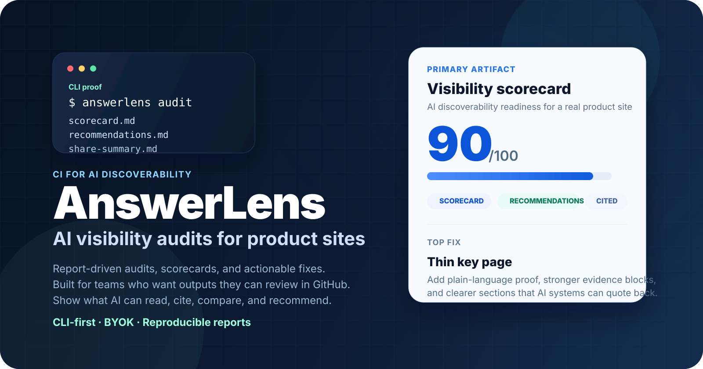
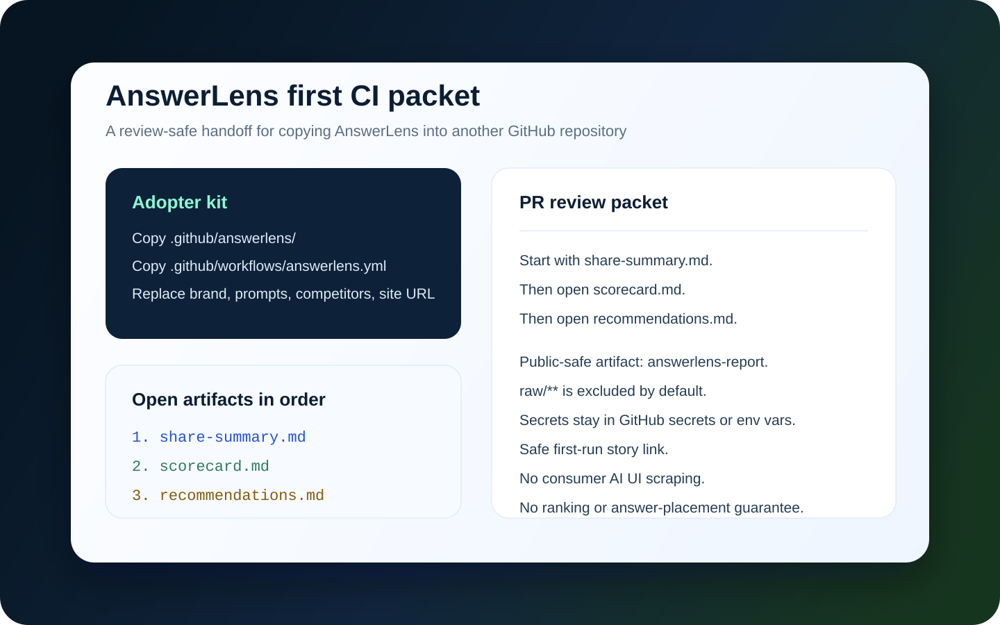

# AnswerLens

[English](README.md) | [简体中文](README.zh-CN.md)

> 面向 AI 可发现性的 CI。

AnswerLens 是一个面向产品网站的命令行优先 AI 可见性审计器。它会审计公开产品页面，并生成团队可以在 GitHub 里审阅的报告文件。

它帮助你判断 AI 系统能否看懂你卖什么、找到支撑证据、读懂定价和对比页面，并引用正确来源。

开源。命令行优先。报告驱动。不抓取消费级 AI 界面。不承诺排名。不要求托管看板。不改成看板优先产品。

## 从这里开始

先看报告，不要先读安装说明：

1. [打开在线演示报告](https://yscjrh.github.io/ai-visibility-auditor/zh/examples/static-good/index.html)
   先看到摘要、评分卡和修复清单放在一起是什么样。
   如果你正在查看没有启用 Pages 的 fork 或副本，请用 [repo 内演示 walkthrough](docs/zh/demo-report.md)。
2. [运行 60 秒示例站点演示](docs/zh/demo-report.md)
   在本地复现同一组报告，让命令路径变得具体。
3. [运行 5 分钟真实站点审计](docs/zh/quickstart.md)
   先用一个公开产品站点试跑，再去接 CI。
4. [添加 GitHub Action](docs/zh/github-action.md)
   把同一组报告放进 PR、产物上传和 `GITHUB_STEP_SUMMARY`。

每一步都保持同样的报告顺序：`share-summary.md`，然后 `scorecard.md`，最后 `recommendations.md`。
第一次 CI 接入 PR 可以沿用 [starter bundle](docs/starter-bundle.md) 里的 `Adopter kit checklist` 和 `PR review packet`，让队友知道先看哪份 artifact，以及哪些 raw payloads 不能公开。

如果你一开始就知道自己要接 CI，Action 文档当然仍然公开可用；但最容易完成的首次路径仍然是：演示报告 -> 示例站点 -> 真实站点 -> Action。

## 你会得到什么

- `audit`：对公开站点或本地示例站点做 AI 可见性审计
- `eval`：通过 OpenAI / Perplexity 适配器做 prompt-pack 基准评估
- `manual-import`：为外部或人工收集的答案样本做归一化评分
- `search-console-import`：把 Search Console 页面级导出与关键页面证据对照验证
- `bing-indexnow-helper`：Bing 验证导入和 IndexNow 辅助产物
- 仓库原生输出：`share-summary.md`、`pr-snippet.md`、`run.json`、`index.html`

## 为什么是 AnswerLens

- 面向 AI 可发现性的 CI，服务于 Git 工作流而不是托管看板锁定
- 规则可解释，聚焦 AI 为什么会错过或误读站点
- 报告优先、仓库内审阅，把运行结果变成团队能推进的报告文件
- 以验证为导向，避免 scrape-and-rank 叙事，并让证据保持可见

## 它不是什么

- 不是“让你在 ChatGPT 排第一”的技巧包
- 不是消费级 AI UI 抓取器
- 不是泛化的 AI 内容生成器
- 不是把命令行审计改成看板优先产品
- 不是 Search Console 或 analytics 的替代品
- 不是任何答案面的排名保证

## 关键文档

- [演示报告 walkthrough](docs/zh/demo-report.md)
- [真实站点 5 分钟 quickstart](docs/zh/quickstart.md)
- [GitHub Action 接入](docs/zh/github-action.md)
- [模型运行时配置](docs/zh/model-runtime.md)
- [人工步骤清单](docs/zh/manual-steps.md)
- [Trust and safety](docs/trust-and-safety.md)
- [First-run story template](docs/first-run-story.md)
- [Self-dogfood log](docs/self-dogfood-log.md)
- [激活计划](docs/zh/activation-plan.md)
- [分发计划](docs/zh/distribution-plan.md)
- [Admin 控制台说明](docs/zh/admin-console.md)

## 反馈和社区

- 第一次试用问题或不清楚的结果：用 [GitHub Discussions](https://github.com/YSCJRH/ai-visibility-auditor/discussions) 的 `Q&A`
- 分享截图、artifact 或 first-run story：用 [Show and tell Discussion form](https://github.com/YSCJRH/ai-visibility-auditor/discussions/new?category=show-and-tell)
- 可复现 bug、文档缺口或具体规则请求：用 [GitHub Issues](https://github.com/YSCJRH/ai-visibility-auditor/issues)

如果你用真实站点试跑了 AnswerLens，请配合 [First-run story template](docs/first-run-story.md) 说明哪份 artifact 最先帮到你。

如果你要跑 live `eval`，请把默认 provider / model / locale / timeout 放进 `runtime.yaml`，把 `OPENAI_API_KEY` 和 `PERPLEXITY_API_KEY` 继续放在环境变量里。需要临时切换推荐配置时，再用 `profile` / `--profile`。第一次 benchmark pass 建议先用 `fast-first-eval`；如果已经有一轮可读的 OpenAI baseline，再用 `perplexity-cross-check` 做 provider 级别的第二意见检查。完整规则和场景决策表见 [docs/zh/model-runtime.md](docs/zh/model-runtime.md)。

如果你需要完整英文细节、更多命令示例和所有仓库文档，请继续查看 [README.md](README.md) 和 `docs/` 下的英文原文。
