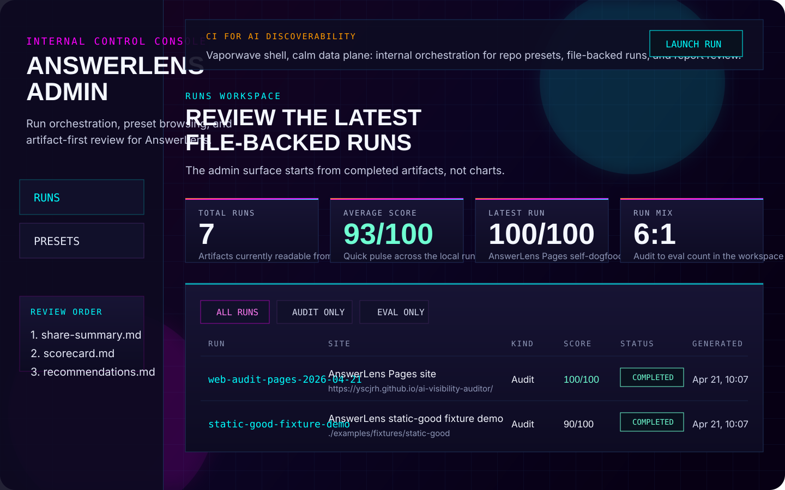

# Admin Console

AnswerLens ships an internal control console in `apps/admin`.

This is not a new public front door and it is not a dashboard-first rewrite. It is a thin internal layer over the same repo-native workflow that already powers the CLI, local runs, and GitHub Action artifacts.



## What it is for

- launch a local `audit` or `eval` without rebuilding command lines by hand
- inspect completed runs from `runs/*`
- review artifacts in the same order we use elsewhere: `share-summary.md`, `scorecard.md`, `recommendations.md`
- browse repo presets without editing YAML in the browser

## What it is not

- not a public SaaS product
- not a multi-user dashboard
- not a replacement for the CLI, Pages, or GitHub-native adoption flow
- not the canonical home for AnswerLens

The canonical home remains the GitHub repository README. The admin console is an internal operator surface.

## Quick start

From the repository root:

```bash
corepack pnpm install
corepack pnpm admin:dev
```

Then open:

- `http://127.0.0.1:4173/runs` for the client
- `http://127.0.0.1:4318/api/health` for the BFF health check

If you want to preview the production bundle instead of the Vite client:

```bash
corepack pnpm build:admin
node --experimental-strip-types apps/admin/server/index.ts
```

Then open `http://127.0.0.1:4318/runs`.

## Route map

- `/runs`
  The default workspace. Use it to scan recent runs, scores, and run kinds.
- `/runs/:runId`
  The artifact review page. Open `share-summary.md` first, then `scorecard.md`, then `recommendations.md`.
- `/presets`
  A read-only view of repo-native config sources such as `./.github/answerlens` and `examples/consumer-repo`.

## Launcher flow

1. Click `Launch run`
2. Pick a preset source
3. Set a site input
4. Choose `audit` or `eval`
5. Wait for the queued job to finish
6. Land in the run detail page for artifact review

The console writes the same file-backed outputs into `runs/*`. It does not invent a second artifact format.

## Package boundaries

- `apps/admin`
  React + Vite client plus the thin Express BFF
- `packages/contracts`
  Browser-safe run, artifact, preset, and job shapes
- `packages/admin-runtime`
  File-system-backed preset discovery, run listing, artifact reading, and queued run orchestration

The admin BFF reuses core AnswerLens logic through `packages/core`, `packages/providers`, and `packages/report`. It does not shell out to a second CLI path for normal `audit` and `eval` launches.

## Verification

- `corepack pnpm test`
- `corepack pnpm typecheck`
- `corepack pnpm build:site`
- `corepack pnpm pack:cli:dry-run`
- `corepack pnpm --dir apps/admin build`

## Why it exists

The public AnswerLens story stays CLI-first and GitHub-native. The admin console exists so maintainers can orchestrate runs, inspect artifacts, and iterate on internal workflows without turning the project into a dashboard-led product.
